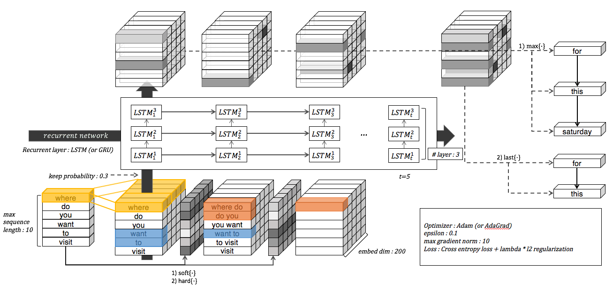

Recurrent Convolutional Memory Network
======================================

An implementation of Recurrent Convolutional Memory Network (still in progress).

Prerequisites
-------------

- Python 2.7 or Python 3.3+
- [TensorFlow](https://www.tensorflow.org/)

Author
------

Taehoon Kim / [@carpedm20](http://carpedm20.github.io/)
